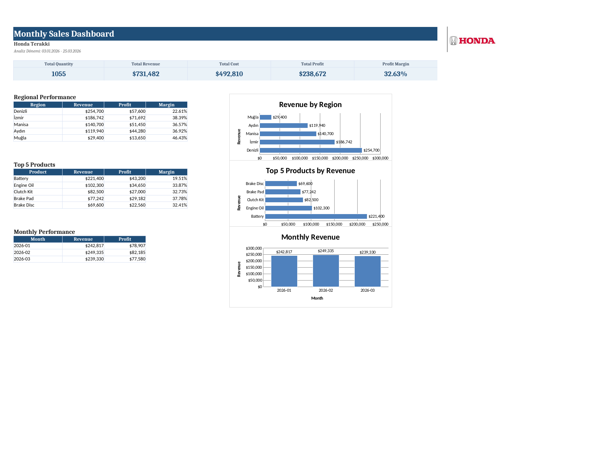
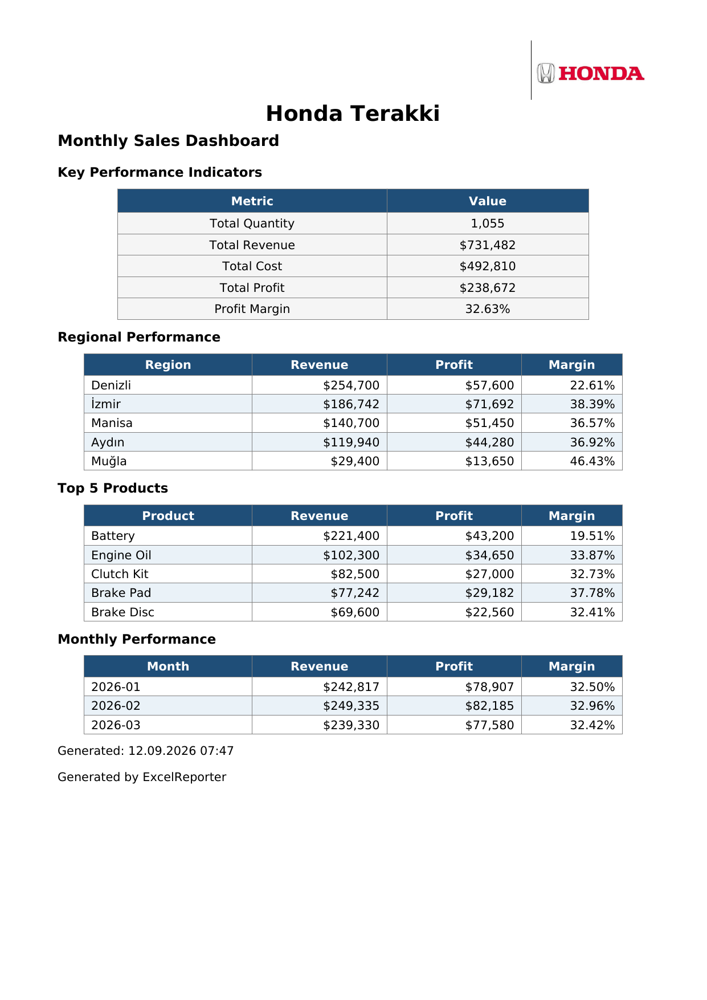

# Excel Reporter

Excel Reporter; şirketlerin elle hazırladığı satış raporlarını otomatikleştiren,
Excel/CSV verilerini okuyup temizleyen, doğrulayan, KPI hesaplayan ve
profesyonel Excel dashboard + PDF yönetici özeti üreten bir Python masaüstü
uygulamasıdır. Windows için tek dosya (.exe) olarak paketlenmiştir.

> **Not:** Bu depo özel (private) bir projedir. Kod, telif hakkı sahibinin
> izni olmadan kopyalanamaz, dağıtılamaz veya kullanılamaz. Bkz. [LICENSE](LICENSE).

---

## Ekran Görüntüleri

**Excel Dashboard**



**PDF Yönetici Özeti**



---

## Özellikler

- Birden fazla Excel/CSV dosyasını otomatik okuma ve birleştirme
- Veri doğrulama: eksik kolon, sayısal olmayan değer, geçersiz tarih,
  negatif değer kontrolü
- Veri temizleme: boş satır ve tekrar eden kayıt temizliği
- KPI hesaplama: toplam ciro, maliyet, kâr, kâr marjı
- Bölgesel, ürün bazlı (Top 5) ve aylık performans analizi
- Excel Dashboard: KPI kartları, tablolar, 3 grafik, kurumsal logo
- Tek sayfalık PDF yönetici özeti (Türkçe karakter desteğiyle)
- Otomatik rapor arşivleme (zaman damgalı)
- JSON ile yapılandırılabilir kurum bilgisi (isim, logo, para birimi)
- Tkinter tabanlı grafik arayüz (GUI)
- PyInstaller ile tek dosya Windows EXE paketleme
- **29 otomatik test** (KPI doğruluğu, validation, edge case'ler,
  gerçek veri baseline karşılaştırması)

---

## Kullanılan Teknolojiler

- Python 3
- pandas, openpyxl (Excel işleme)
- ReportLab (PDF üretimi, Unicode/Türkçe font desteği)
- Loguru (loglama)
- pytest (test)
- PyInstaller (EXE paketleme)

---

## Proje Yapısı

```
ExcelReporter/
│
├── assets/
│   ├── logo.png
│   └── fonts/              (PDF için Türkçe karakter destekli fontlar)
│
├── data/
│   ├── input/               (örnek/kaynak veri)
│   ├── output/               (üretilen rapor - otomatik oluşur)
│   └── archive/              (arşivlenen raporlar - otomatik oluşur)
│
├── src/                      (kaynak kod)
├── tests/                    (29 otomatik test)
├── config.json
├── requirements.txt
├── ExcelReporter.spec         (PyInstaller yapılandırması)
└── README.md
```

---

## Kurulum

```
git clone https://github.com/aliyagiz207-maker/ExcelReporter.git
cd ExcelReporter
python -m venv .venv
.venv\Scripts\activate
pip install -r requirements.txt
```

---

## Kullanım

```
python src/main.py
python src/main.py --month january
python src/main.py --month january march
```

Testleri çalıştırmak için:

```
python -m pytest -v
```

Windows EXE üretmek için:

```
pyinstaller ExcelReporter.spec --clean
```

---

## Yapılandırma

Tüm uygulama ayarları `config.json` üzerinden değiştirilebilir:

```json
{
    "company_name": "Örnek Şirket A.Ş.",
    "dashboard_title": "Monthly Sales Dashboard",
    "currency": "$",
    "logo_path": "assets/logo.png",
    "output_file": "data/output/Report.xlsx"
}
```

---

## Lisans / Kullanım Koşulları

Bu proje özeldir ve tüm hakları saklıdır. Ayrıntılar için [LICENSE](LICENSE)
dosyasına bakınız. Kullanım, kopyalama veya dağıtım için yazılı izin
gereklidir.

---

## Geliştirici

**Ali Yağız Demir**
GitHub: <https://github.com/aliyagiz207-maker>
